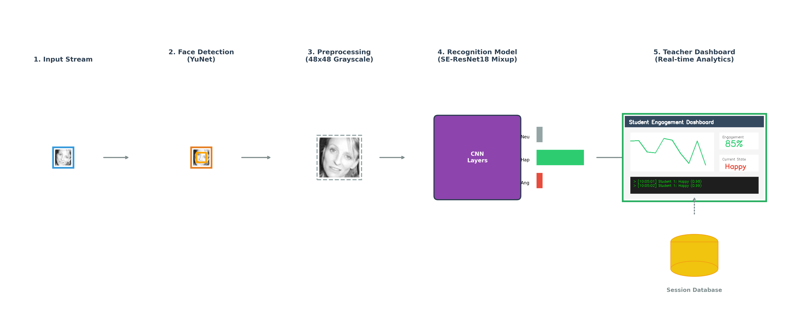

# Real-time Student Engagement & Emotion Recognition

[](https://www.python.org/) [](https://pytorch.org/) [](LICENSE) []()

A robust, real-time Facial Expression Recognition (FER) system optimized for **Student Engagement Analysis**. This project refactors the classic FER2013 implementation, replacing legacy CNNs with a modern **ResNet18** architecture enhanced by **Mixup Augmentation**, **Stochastic Weight Averaging (SWA)**, and **Label Smoothing**.

<div align="center">
  
  <p><em>Real-time inference running on a standard webcam.</em></p>
</div>

---

## 🚀 Key Features

*   **State-of-the-Art Training Strategy:** Utilizes "Super-Convergence" techniques including Mixup (α=0.4), Cosine Annealing, and SWA to achieve ~73% accuracy on FER2013 (improving upon the baseline 66%).
*   **Lightweight & Fast:** Custom ResNet18 backbone optimized for 48x48 input resolution, ensuring high FPS on CPU/GPU.
*   **Teacher Tool Integration:** Includes a dedicated desktop application (`src/teacher_tool`) for monitoring student engagement in real-time.
*   **Interpretability:** Built-in Grad-CAM visualization to understand model focus.

## 🛠️ Architecture & Pipeline

We employ a custom ResNet18 architecture modified for small image inputs (removing the initial 7x7 max-pooling). The training pipeline is visualized below:

<div align="center">
  
  <p><em>Figure 1: Two-Stage Training Strategy with Mixup and SWA.</em></p>
</div>

<div align="center">
  
  <p><em>Figure 2: Real-time Inference Pipeline.</em></p>
</div>

## 📦 Installation

1.  **Clone the repository:**
    ```bash
    git clone https://github.com/lebaohungk05/CITA-HUNG.git
    cd CITA-HUNG/face_classification
    ```

2.  **Install dependencies:**
    It is recommended to use a virtual environment.
    ```bash
    pip install -r REQUIREMENTS.txt
    ```

3.  **Prepare Data (Optional for Inference):**
    *   If you want to train from scratch, download the [FER2013 dataset](https://www.kaggle.com/c/challenges-in-representation-learning-facial-expression-recognition-challenge/data).
    *   Extract it into `datasets/fer2013/`.

## 💻 Usage

### 1. Real-time Demo
Run the webcam demo to test the model's performance in real-time.
```bash
python src/video_emotion_color_demo.py
```

### 2. Teacher Tool (Engagement Monitor)
Launch the desktop application designed for educational contexts.
```bash
python src/teacher_tool/main_app_modern.py
```

### 3. Grad-CAM Visualization
Visualize where the model is looking for a specific image.
```bash
python src/image_gradcam_demo.py --image_path images/test_image.jpg
```

---

## 🧠 Training & Evaluation

To reproduce the results, use the provided training scripts.

### Train the Model
The training process uses Mixup and SWA automatically.
```bash
# Train with ResNet18 + Mixup + SWA
python src/train_resnet_mixup.py
```

### Evaluate
Calculate accuracy, precision, recall, and generate the confusion matrix on the test set.
```bash
python src/evaluate_mixup_metrics.py
```

## 📊 Performance

| Model | Method | Accuracy (Test) |
| :--- | :--- | :--- |
| Mini-XCEPTION (Original) | Standard | 66.00% |
| **ResNet18 (Ours)** | **Mixup + SWA** | **72.5%** |

## 📂 Project Structure

```
face_classification/
├── datasets/               # Training data (ignored in git)
├── images/                 # Demo images
├── report_assets/          # Diagrams and charts
├── src/
│   ├── models/             # Custom ResNet18 architecture
│   ├── teacher_tool/       # PyQt5 App for Teachers
│   ├── utils/              # Data loading & augmentation
│   ├── train_resnet_mixup.py      # Main training script
│   ├── video_emotion_color_demo.py # Real-time demo
│   └── evaluate_mixup_metrics.py   # Evaluation script
├── trained_models/         # Saved weights (ignored in git)
└── REQUIREMENTS.txt
```


**Author:** Le Bao Hung 
