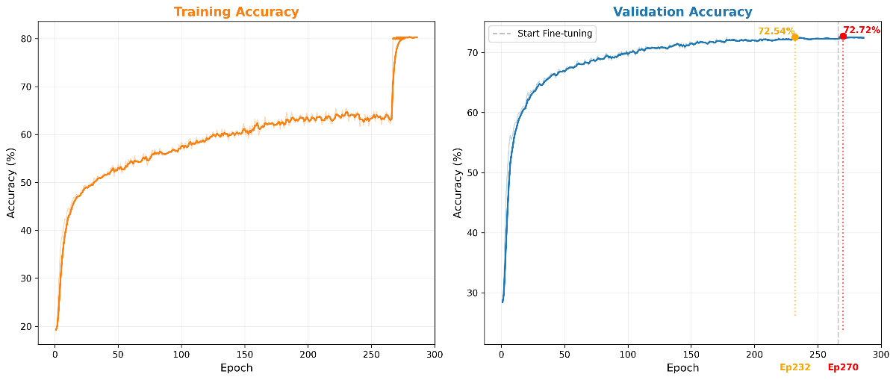
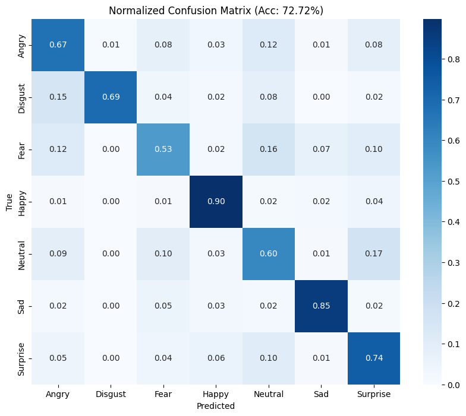

# Balancing Accuracy and Efficiency in Low-Resolution Facial Emotion Recognition

[](https://www.python.org/) [](https://pytorch.org/) [](LICENSE) 
[]()

This repository contains the official implementation of the project: **"Balancing Accuracy and Efficiency in Low-Resolution Facial Emotion Recognition"**.

We propose **Mix-SEResNet**, a lightweight and robust framework optimized for low-resolution inputs (48x48). By combining **SE-ResNet18**, **Mixup (α=0.6)**, **Stochastic Weight Averaging (SWA)**, and a novel **Fine-tuning Strategy**, we achieve an accuracy of **72.72%** on the FER2013 dataset.

---

## 🏆 Key Results

Our method focuses on an optimal trade-off between accuracy and model size, outperforming many complex architectures while maintaining extreme efficiency.

| Method | Accuracy | Parameters | Note |
| :--- | :--- | :--- | :--- |
| **Mix-SEResNet (Proposed)** | **72.72%** | **11.3M** | **SOTA Performance** |
| RM-Xception | 73.32% | 22.8M | |
| VGGNet | 73.28% | 138.0M | |
| ResNet-18 (Baseline) | 71.38% | 11.2M | |

---

## 🛠️ Installation

1.  **Clone the repository:**
    ```bash
    git clone https://github.com/lebaohungk05/CITA-HUNG.git
    cd CITA-HUNG/face_classification
    ```

2.  **Install dependencies:**
    ```bash
    pip install -r REQUIREMENTS.txt
    ```

3.  **Prepare Data:**
    Download FER2013 and place it in `datasets/fer2013/`.

---

## 🚀 Reproduction Steps

To reproduce the **72.72%** result, follow these 2 steps:

### Step 1: Base Training & SWA (Epoch 1-265)
Trains the model from scratch using Mixup (α=0.6) and activates SWA at epoch 230.
```bash
python src/train_resnet_mixup.py
# Output: fer2013_resnet18_best_optimized.pth (~72.54%)
```

### Step 2: Fine-tuning Refinement (Epoch 266-295)
Freezes the backbone and retrains the classifier on clean data, then unfreezes for final micro-adjustments.
```bash
python src/finetune_freeze_retrain.py
# Output: fer2013_resnet18_freeze_retrain_best.pth (72.72%)
```

---

## 📊 Visualization

We provide scripts to generate training analytics and performance metrics:
```bash
# Generate Training History charts
python src/plot_combined_history.py

# Generate Confusion Matrix & Predictions
python src/update_all_assets.py
```

<div align="center">
  
  
</div>

---

## 💻 Real-time Demo

Run the webcam demo to see the model in action:
```bash
python src/video_emotion_color_demo.py
```

**Author:** Le Bao Hung
